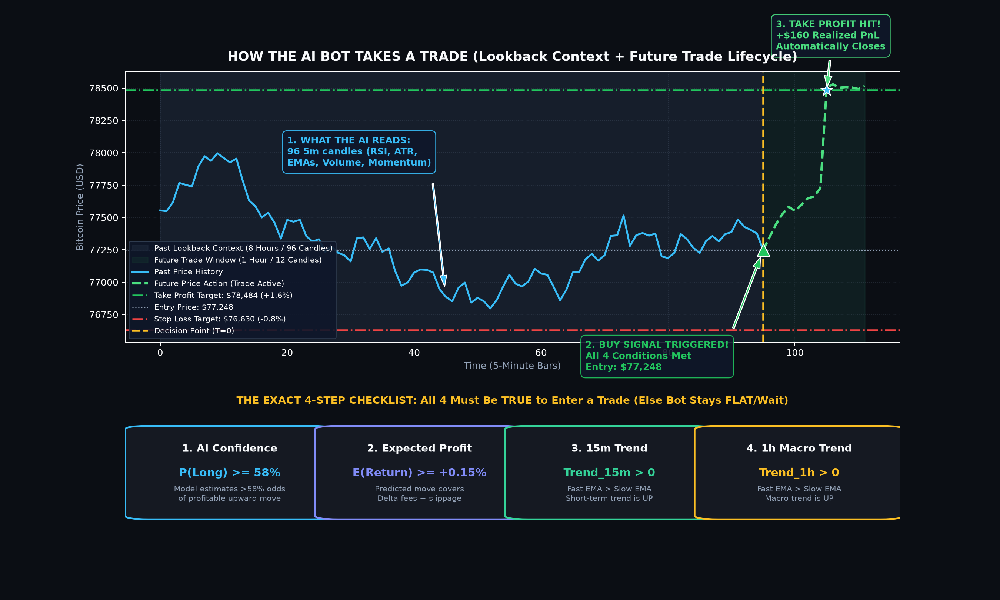

# ⚡ Delta AI Trading Bot — Institutional-Grade Neural Execution

An advanced algorithmic crypto trading system engineered for **Delta Exchange** (India & Global), powered by a 2-layer **GRU Recurrent Neural Network** for multi-horizon return estimation and trade probability forecasting. Accompanied by an institutional-grade dark-themed **Streamlit Trading Terminal**.



---

## 🌟 Key Features

1. **GRU Deep Sequence Model**:
   - Analyzes **96 bars** of 5-minute OHLCV context (8 hours of market memory).
   - Forecasts next **12-bar** price trajectory (1 hour forward horizon).
   - Generates dual output: Expected Return % & Favorable Move Probability (Threshold $\ge 58\%$).

2. **Institutional Dark Terminal UI (Streamlit)**:
   - **Real-Time Interactive Candlestick Chart**: Plotly chart with 96-bar AI Lookback Window and forward-looking Predictive Price Cone.
   - **Visual Infographic & HUD**: Live 4-step decision pipeline checklist (Market Scanner $\to$ Model Inference $\to$ Risk Validation $\to$ Order Execution).
   - **Live Terminal & Smart Auto-Scroll**: Terminal with PAUSE/RESUME badge that lets you scroll up to inspect previous logs without being dragged down by new incoming logs.
   - **Full Control Panel**: Live symbol selector (BTC, ETH, SOL, XRP, DOGE, PEPE, etc.), timeframe tuner (1m to 1d), leverage slider, order size, API credentials, and dry-run toggles.
   - **Live Metrics**: Account Balance, Margin Usage, Unrealized P&L, 24h Trading Volume, and Model Confidence.

3. **Risk Management Engine**:
   - Dynamic stop-loss & take-profit calculation.
   - Maximum position fraction capping & max daily drawdown circuit breaker.
   - Zero-averaging-down safety protocol and one-click emergency kill-switch.

---

## 🚀 Quick Start (Local Setup)

### 1. Clone the Repository
```bash
git clone https://github.com/KunalBabber/ai_trading_bot.git
cd ai_trading_bot
```

### 2. Create Virtual Environment & Install Dependencies
```bash
python -m venv .venv
# On Windows:
.venv\Scripts\activate
# On Linux/macOS:
source .venv/bin/activate

pip install -r requirements.txt
```

### 3. Configure Credentials
Copy `.env.example` to `.env`:
```bash
cp .env.example .env
```
Edit `.env` with your Delta Exchange API credentials:
```env
DELTA_API_KEY=your_delta_api_key
DELTA_API_SECRET=your_delta_api_secret
DELTA_BASE_URL=https://cdn-ind.testnet.deltaex.org
DRY_RUN=true
```

### 4. Launch the Trading Dashboard
```bash
streamlit run app.py
```
Visit `http://localhost:8501` in your browser.

---

## ☁️ Deploy to Streamlit Community Cloud

You can deploy this application for free in under 2 minutes:

1. **Fork or Push** this repository to your GitHub account: `https://github.com/KunalBabber/ai_trading_bot`
2. Go to **[share.streamlit.io](https://share.streamlit.io)** and log in with your GitHub account.
3. Click **"New app"**.
4. Configure your deployment settings:
   - **Repository:** `KunalBabber/ai_trading_bot`
   - **Branch:** `main`
   - **Main file path:** `app.py`
5. Click **"Advanced settings..."** and configure your **Secrets (TOML)**:
   ```toml
   DELTA_API_KEY = "your_actual_delta_api_key"
   DELTA_API_SECRET = "your_actual_delta_api_secret"
   DELTA_BASE_URL = "https://cdn-ind.testnet.deltaex.org"
   DRY_RUN = "true"
   ```
6. Click **Deploy!** Your trading bot dashboard will be live on a public or private HTTPS URL.

---

## 🧠 Model Architecture & Strategy Rules

| Parameter | Value / Logic | Description |
|---|---|---|
| **Input Shape** | `(Batch, 96, 16)` | 96 timesteps (8 hours) $\times$ 16 normalized technical features |
| **Model** | 2-Layer GRU (hidden=96, dropout=0.20) | Extracts temporal micro-structure patterns |
| **Buy Signal** | `P(up) >= 0.58` & `Expected Return >= +0.15%` | High confidence bullish divergence |
| **Sell Signal** | `P(down) >= 0.58` & `Expected Return <= -0.15%` | High confidence bearish breakdown |
| **Default Risk** | 0.8% Stop Loss / 1.6% Take Profit (1:2 R:R) | Asymmetric positive payoff profile |

---

## 📁 Repository Structure

```
ai_trading_bot/
├── app.py                      # Streamlit interactive control center & dashboard
├── bot_manager.py              # Background bot runner & thread-safe state manager
├── delta_client.py             # Delta Exchange REST v2 client (signed authentication)
├── live_trader.py              # Core execution loop & decision engine
├── live_features.py            # Real-time feature calculation & scaler transformer
├── features.py                 # Feature engineering definitions
├── model.py                    # PyTorch GRU neural network architecture
├── strategy.py                 # Signal generation, sizing & regime filters
├── train.py                    # Offline training pipeline with early stopping
├── backtest.py                 # Event-driven backtesting engine
├── config.yaml                 # Bot hyperparameters and risk thresholds
├── requirements.txt            # Production dependencies (CPU-optimized PyTorch)
├── .env.example                # Environment variables template
├── artifacts/
│   ├── gru.pt                  # Pre-trained GRU weights
│   ├── scaler.joblib           # Pre-fitted RobustScaler
│   └── ai_trade_lifecycle_diagram.png # Process explainer infographic
└── data/
    └── example_5m.csv          # Sample historical OHLCV data
```

---

## ⚠️ Disclaimer
*Cryptocurrency trading involves substantial risk of loss and is not suitable for every investor. The valuation of cryptocurrencies and related products may fluctuate drastically. This software is for research and educational purposes only. Always thoroughly paper-trade before deploying real capital.*

